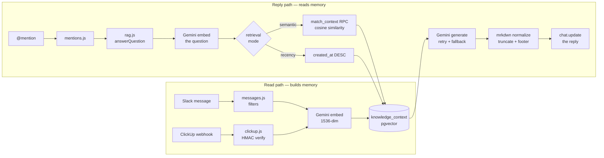
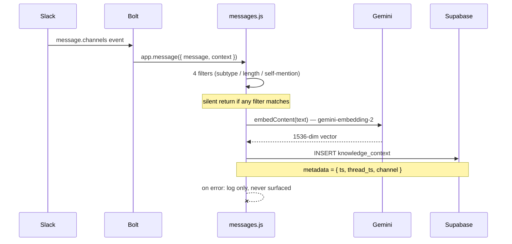
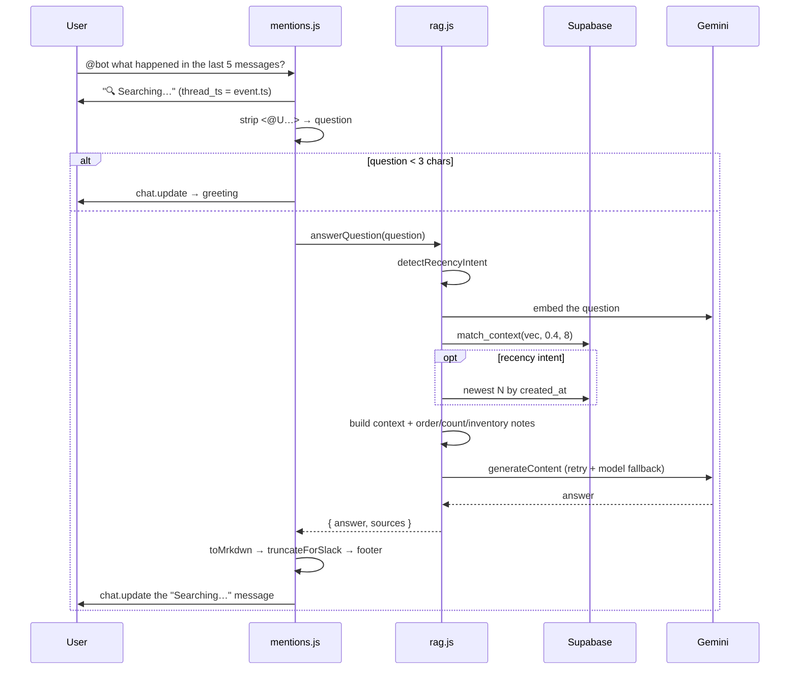
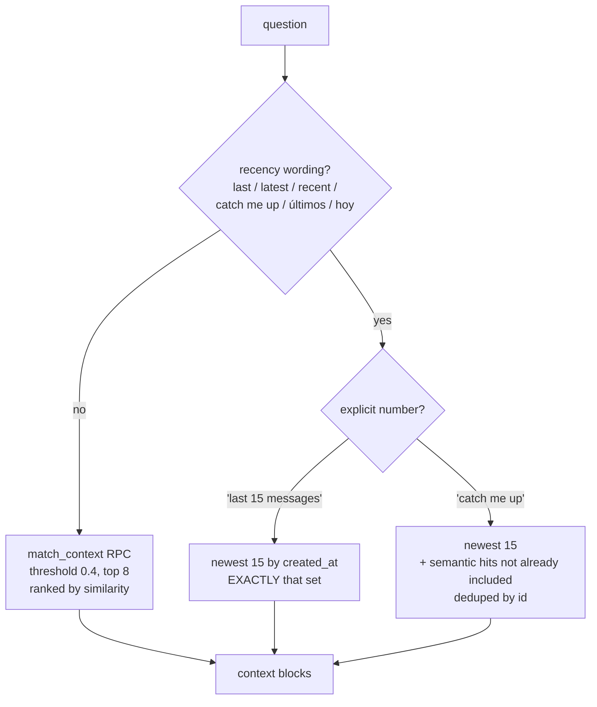
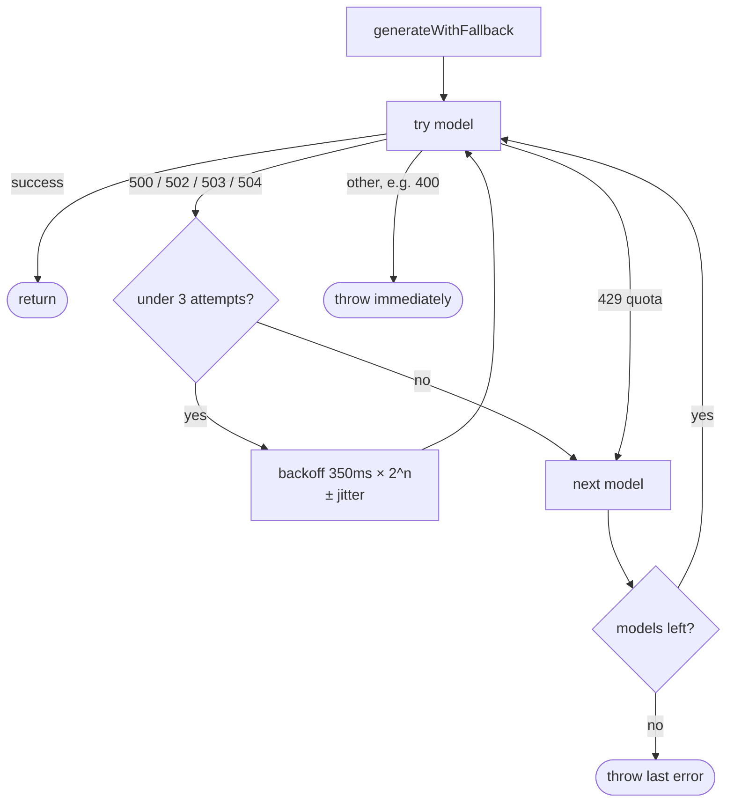
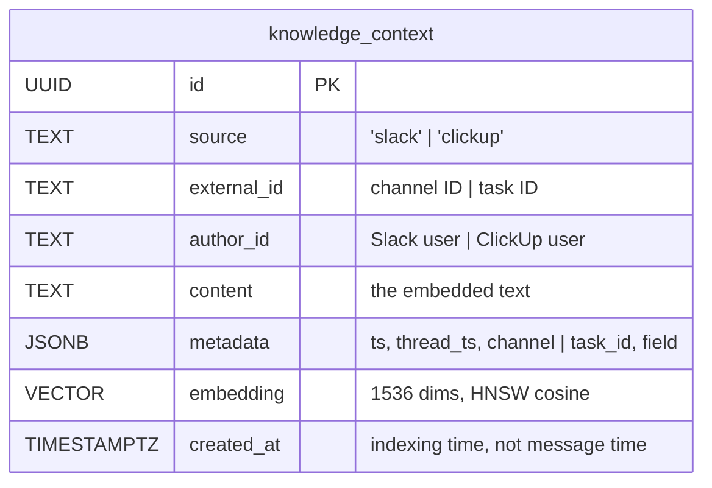
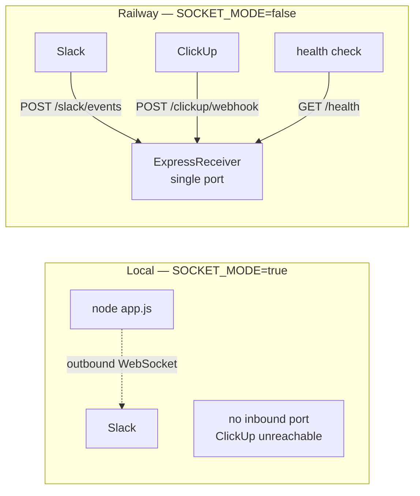
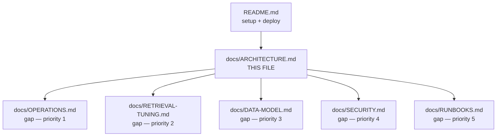

# PM-Insight-Hub — Architecture

How the bot reads, how it replies, and where the sharp edges are.

Every line reference points at real code. If a reference drifts, trust the code and fix this file.

---

## 1. The two paths

The bot does exactly two things, and they never touch each other at runtime:

| | **Read path** (write to memory) | **Reply path** (read from memory) |
|---|---|---|
| Trigger | Any human message in a channel the bot is in | The bot is `@mentioned` |
| Handler | [`messages.js`](../src/listeners/messages.js) | [`mentions.js`](../src/listeners/mentions.js) |
| Gemini call | 1 embedding | 1 embedding + 1 generation |
| Writes to DB | Yes | No |
| Failure visible to user | **No** — logged and swallowed | Yes — posts an error in-thread |

They share only the `knowledge_context` table. The read path is the *only* thing that
populates it, which means **the bot can only ever answer from messages posted while it
was running.** Nothing backfills channel history.



---

## 2. Read path — how the bot builds memory

### 2.1 Slack messages

Bolt delivers `message.channels` / `message.groups` to the handler at
[`messages.js:11`](../src/listeners/messages.js#L11). Four filters run before any API call,
in this order — each one exists for a reason:

| Filter | Line | Why |
|---|---|---|
| `message.subtype \|\| message.bot_id` | [13](../src/listeners/messages.js#L13) | Skips joins, edits, deletes, and other bots — including itself, which would otherwise loop |
| `text.trim().length < 10` | [16](../src/listeners/messages.js#L16) | "ok", "thanks", "👍" are cost without signal |
| Text contains `<@BOT_ID>` | [21](../src/listeners/messages.js#L21) | **Questions are not knowledge.** Without this, every question asked becomes retrievable context and crowds out real content |
| — | | Anything surviving all four gets embedded |

Then: embed → insert.



**The important consequence:** the `catch` at
[`messages.js:40`](../src/listeners/messages.js#L40) logs and returns. If Gemini is rate
limited, indexing stops **silently** — no Slack signal, no alert. The bot slowly goes blind
and the only symptom is worse answers. This is the highest-value thing left to instrument.

### 2.2 ClickUp webhooks

HTTP mode only. `express.raw` keeps the body as a `Buffer` so the HMAC is computed over the
exact bytes Slack sent — parsing first would break the signature.

1. `POST /clickup/webhook` → raw body preserved ([`clickup.js:100`](../src/listeners/clickup.js#L100))
2. HMAC SHA-256 over the raw body, compared with `crypto.timingSafeEqual`
3. **Fails closed** when `CLICKUP_WEBHOOK_SECRET` is unset ([`clickup.js:15`](../src/listeners/clickup.js#L15)) — an unconfigured deploy rejects everything rather than trusting everything
4. `extractTaskContent` flattens the event into one sentence per type — `taskCreated`, `taskUpdated`, `taskCommentPosted`, `taskStatusUpdated`
5. **Responds `200` before embedding** ([`clickup.js:123`](../src/listeners/clickup.js#L123)) so ClickUp doesn't time out and retry

> **Currently inactive.** `CLICKUP_WEBHOOK_SECRET` is unset in production, so this path
> rejects every request and there are zero ClickUp rows. Any question about tasks is
> answered "not indexed" by design (§3.4).

---

## 3. Reply path — how the bot answers



### 3.1 The placeholder is the reply

[`mentions.js:52`](../src/listeners/mentions.js#L52) posts "🔍 Searching…" and keeps its
`ts`. The final answer **overwrites that same message** via `chat.update`
([line 80](../src/listeners/mentions.js#L80)) — which is why Slack shows *(edited)*. If the
update fails, it falls back to posting a fresh threaded message
([line 88](../src/listeners/mentions.js#L88)) so an answer is never lost.

### 3.2 Retrieval: two modes, one decision

This is the part worth understanding. **pgvector ranks by cosine similarity and has no
concept of time**, so "the last 15 messages" is unanswerable by semantic search — no amount
of prompting fixes it. Intent is detected from wording at
[`rag.js:165`](../src/rag.js#L165) (English + Spanish).



Why an explicit count returns *exactly* that set: padding it with semantic extras made the
source footer report 20 items when 15 were asked for — the exact mismatch that made an
earlier reply look broken.

| Knob | Value | Where |
|---|---|---|
| `SIMILARITY_THRESHOLD` | `0.4` | [`rag.js:33`](../src/rag.js#L33) |
| `MAX_RESULTS` (semantic) | `8` | [`rag.js:34`](../src/rag.js#L34) |
| `DEFAULT_RECENCY_COUNT` | `15` | [`rag.js:39`](../src/rag.js#L39) |
| `MAX_RECENCY_COUNT` | `30` | [`rag.js:40`](../src/rag.js#L40) |
| `MAX_OUTPUT_TOKENS` | `4096` | [`rag.js:32`](../src/rag.js#L32) |

### 3.3 Context blocks carry rendering tokens, not raw JSON

`buildContextHeader` ([`rag.js:184`](../src/rag.js#L184)) produces:

```
--- [1] 💬 Slack · <#C0AAVSXQTS7> · <!date^1785161328^{date_short_pretty} {time}|…> ---
<message text>
```

`<#C…>` and `<!date^…>` are **Slack rendering tokens**: Slack expands them client-side into
a channel name and each reader's *own* timezone. Two consequences worth knowing:

- The bot shows channel names **without holding the `channels:read` scope**, which it doesn't have.
- If the model echoes a token verbatim it still renders correctly — so echoing is desirable, not a leak.

The predecessor dumped raw `metadata` JSON into the prompt, and the model faithfully printed
`C0BLAE2U0AU` and `1784950401.358739` at users. Never put raw metadata in the prompt.

### 3.4 Three notes appended to every prompt

| Note | Condition | Prevents |
|---|---|---|
| Order | recency mode | Model treating a time-ordered list as relevance-ordered |
| Count shortfall | fewer rows than requested | Model inventing rows to hit the number |
| **Source inventory** | always | Answering "last 10 *tasks*" from Slack messages, because every block looks equally authoritative |

### 3.5 Output normalization — three transforms, in order

Applied at [`mentions.js:76`](../src/listeners/mentions.js#L76):

1. **`toMrkdwn`** — Slack mrkdwn is *not* Markdown. Bold is a **single** asterisk; `**bold**`
   renders its asterisks literally, and `-`/`*` list syntax is unsupported. Gemini emits
   GitHub Markdown regardless of instructions, so this is enforced in code, not by prompt.
   Fenced code blocks pass through untouched.
2. **`truncateForSlack`** — bounds the body at 3800 chars, cutting on a bullet boundary so a
   partial `<!date^…>` can never render as broken literal text.
3. **`buildSourceFooter`** ([`mentions.js:12`](../src/listeners/mentions.js#L12)) — counts,
   distinct channels (max 4 + overflow), and a date span. Deliberately *not* similarity
   scores: those were developer diagnostics that meant nothing to readers.

> **Trap for future edits:** in `slack-format.js`, line-anchored regexes use `[ \t]`, never
> `\s`. `\s` matches `\n`, which lets a match reach back into the preceding blank line and
> silently delete paragraph breaks. This bug shipped once and was caught in testing.

### 3.6 Resilience

Gemini returns transient `503 UNAVAILABLE` often enough that one attempt is not viable —
measured at **1 failure in 4** on `gemini-2.5-flash`. Policy at
[`rag.js:111`](../src/rag.js#L111):



Chain: `gemini-2.5-flash` → `gemini-flash-latest` → `gemini-3.5-flash`.

- `429` is **not** retried in-request — Gemini's own `retryDelay` for an exhausted quota is
  tens of seconds, longer than a Slack reply can wait. Fail over instead.
- Jitter prevents concurrent mentions from retrying in lockstep.
- **Already load-bearing:** `gemini-2.5-flash` hit its daily free-tier quota during testing
  and traffic now completes on `gemini-flash-latest` with no user-visible impact.

---

## 4. Data model

One table does everything. Slack messages and ClickUp events share a schema so a single
vector search spans both sources.



Things that will bite you:

- **`created_at` is indexing time, not message time.** Recency ordering uses it as a proxy.
  The true Slack message time is `metadata.ts`, which is what `rowEpoch` prefers.
- **RLS is on with zero policies.** The app uses the `service_role` key, which bypasses RLS;
  the anon key therefore has *no* access even if it leaks. Never move this key client-side.
- **1536 dimensions**, from `gemini-embedding-2`. Changing the embedding model almost
  certainly changes this and requires a column migration plus a full re-index.
- **No unique constraint.** A redelivered Slack event creates a duplicate row that
  double-counts in retrieval.
- **The deployed `match_context` does not return `external_id`**, so the reply path reads the
  channel from `metadata.channel` instead. Re-running the function from
  [`sql/schema.sql`](../sql/schema.sql) would sync it.

---

## 5. Deployment topology



Both modes are the same process, branching at [`app.js:18`](../app.js#L18).

- **Socket Mode** dials out over a WebSocket — no public URL, so the ClickUp webhook is
  unreachable. Local development only.
- **HTTP Mode** shares one port between Slack events and the ClickUp webhook, because
  single-port PaaS platforms expose exactly one. Bolt registers its body parser
  *route-scoped* to `/slack/events`, so it does not interfere with the ClickUp router's
  `express.raw` — verified with real signed requests.
- **The two modes are mutually exclusive at the Slack end.** While Socket Mode is enabled in
  the Slack app config, Slack delivers over the socket and **ignores the HTTP Request URL**,
  so a healthy HTTP deploy receives nothing.

Deploys are **CLI-driven** (`railway up`), *not* GitHub-connected — merging to `main` does
not deploy. Production is whatever was last uploaded.

---

## 6. Known limitations

Ordered by how likely they are to bite.

| # | Limitation | Impact | Sketch of a fix |
|---|---|---|---|
| 1 | Indexing fails **silently** on a Gemini 429 | Bot goes blind with no signal; answers just get worse | Counter + threshold alert; dead-letter the failed text for retry |
| 2 | "this channel" / "here" is ignored | Channel-scoped questions answered workspace-wide | Pass `event.channel` into `answerQuestion`; filter or boost on it |
| 3 | Aggregate questions can't work | "Who sends the most messages per day?" needs `GROUP BY author_id`, not top-8 retrieval | Detect aggregate intent, route to a SQL path instead of RAG |
| 4 | No dedupe | Redelivered events duplicate rows and double-count | Unique index on `(source, external_id, metadata->>'ts')` |
| 5 | No history backfill | Empty until traffic accumulates | One-off `conversations.history` import (needs `channels:history`) |
| 6 | ClickUp inactive | Task questions always "not indexed" | Set `CLICKUP_WEBHOOK_SECRET`, register the webhook |
| 7 | Free-tier quota | Primary model already exhausts daily | Enable billing |
| 8 | Author IDs never resolved | `author_id` stored, never used in answers | `<@U…>` renders names free — surface it in context headers |

---

## 7. Documentation map

What exists, and what to write next.



| Doc | Status | Should cover | Why |
|---|---|---|---|
| [`README.md`](../README.md) | ✅ exists | Setup, scopes, deploy | Accurate as of the 1536-dim fix |
| **`ARCHITECTURE.md`** | ✅ this file | Both paths, data model, topology | — |
| `OPERATIONS.md` | ❌ **priority 1** | Reading logs, what each WARN means, quota checks, how to tell if indexing stalled | Limitation #1 is invisible without it |
| `RETRIEVAL-TUNING.md` | ❌ priority 2 | What threshold `0.4` and top-8 do to answers; how to evaluate a change | These knobs get tuned blind today |
| `DATA-MODEL.md` | ❌ priority 3 | Migration procedure, re-index playbook, dimension changes | Changing embedding model is a footgun |
| `SECURITY.md` | ❌ priority 4 | Key inventory, rotation, RLS rationale, HMAC fail-closed | service_role bypasses RLS — needs to be written down |
| `RUNBOOKS.md` | ❌ priority 5 | "Bot silent", "answers are stale", "everything 503s" | Turns tribal knowledge into procedure |

### Suggested reading order for a new contributor

1. `README.md` — get it running locally in Socket Mode
2. §1 and §2 here — understand that memory is built only while running
3. §3.2 — the semantic/recency split explains most "wrong answer" reports
4. §6 — before proposing a fix, check it isn't already a known limitation

---

## 8. Change log of architectural decisions

| Decision | Rationale |
|---|---|
| Single `knowledge_context` table for both sources | One vector search spans Slack and ClickUp; no join, no union |
| `service_role` key + RLS with no policies | Server-only app; anon key gets zero access even if leaked |
| Placeholder message updated in place | Immediate feedback without a second message in-thread |
| mrkdwn enforced in code, not prompt | The model ignores formatting instructions often enough to matter |
| Retry + model fallback over a single call | Measured 1-in-4 transient failure rate on the primary model |
| Explicit counts return an exact set | Semantic padding made the footer contradict the question |
| ClickUp HMAC fails closed | An unconfigured deploy must reject, not trust |
